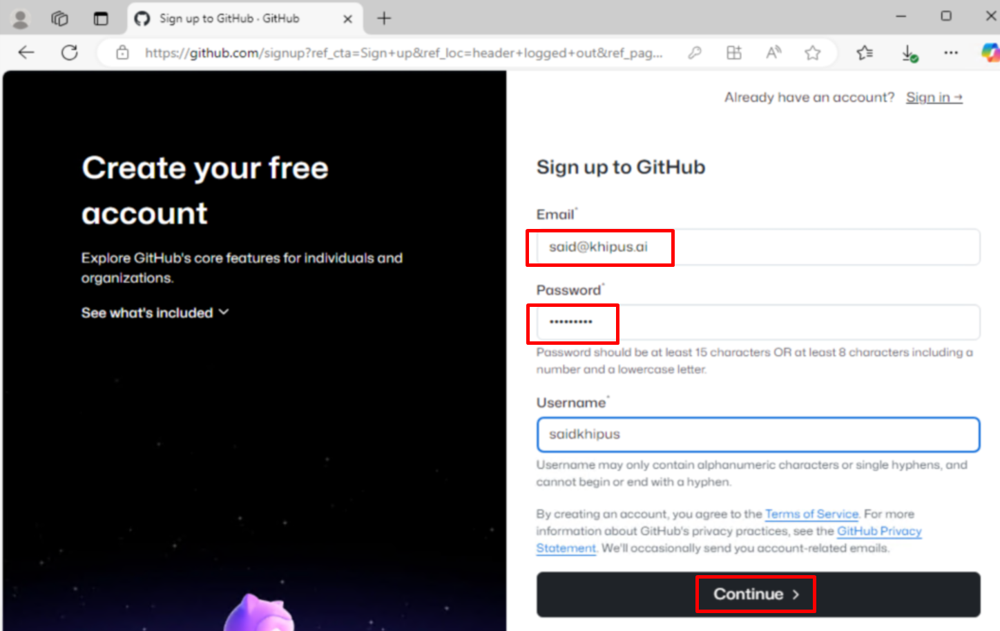

# **Khipus.ai**

# How to Create a GitHub Account

# © Copyright Notice 2025, Khipus.ai - All Rights Reserved.

Follow these steps to create your own GitHub account.

## Step 1: Go to the GitHub Website
1. Open a web browser.
2. Visit the [GitHub website](https://github.com/).

## Step 2: Start the Sign-Up Process
- Click the **Sign Up** button in the top-right corner of the homepage.

## Step 3: Enter Your Details
1. **Email Address**:
   - Enter your email in the provided field.
2. **Create a Password**:
   - Use a strong, secure password.
3. **Choose a Username**:
   - Select a unique username. GitHub will indicate if it’s already taken.

4. **Verify You’re Human**:
   - Complete the CAPTCHA if prompted.

## Step 4: Complete Account Creation
2. Open your email inbox.
3. Verify your email by clicking the link in the email from GitHub.

## Step 5: Start Using GitHub
- Your account is ready! Begin exploring, creating repositories, and collaborating.

---

For more information, visit the [GitHub Help Center](https://docs.github.com/en).
