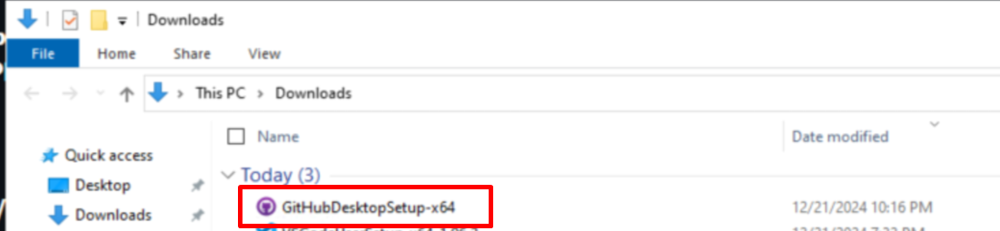
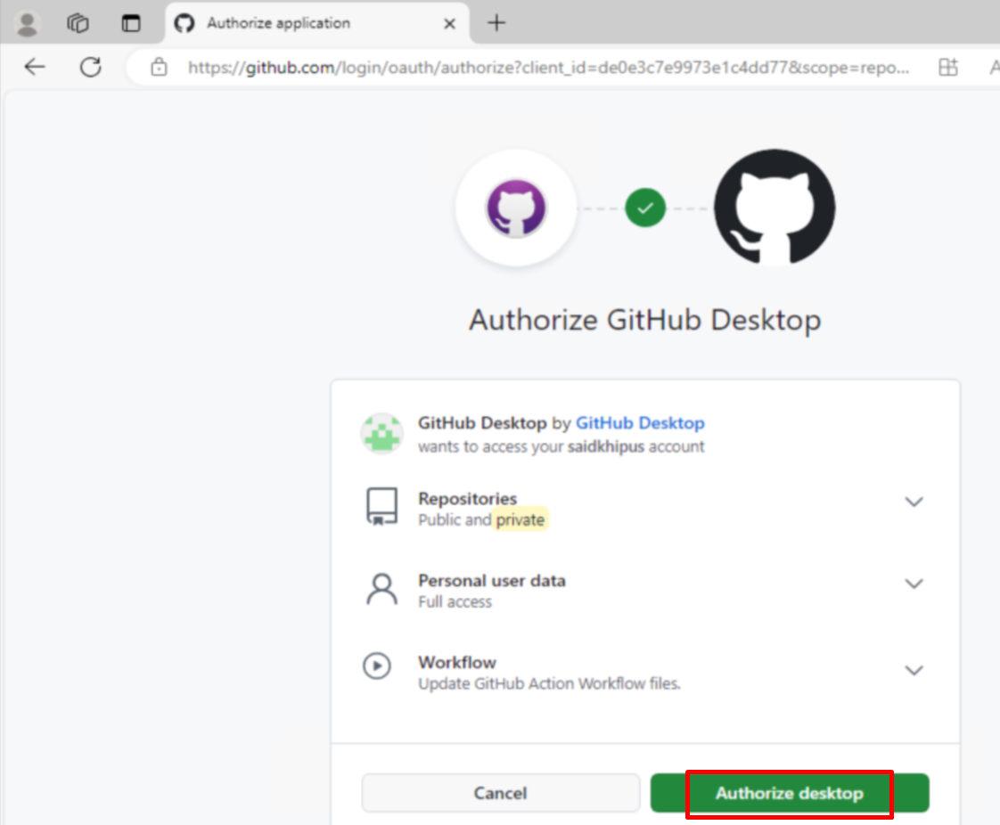
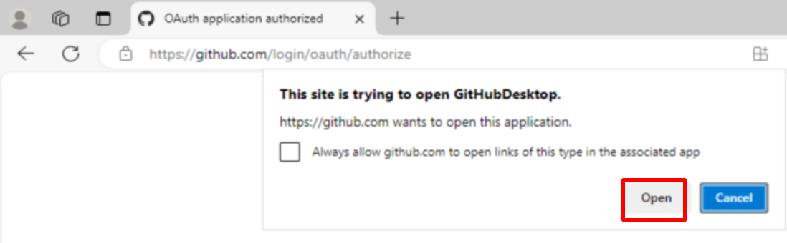
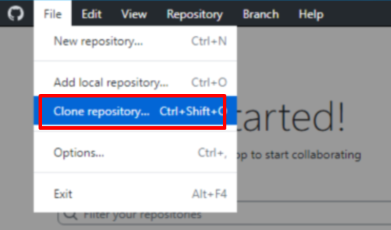
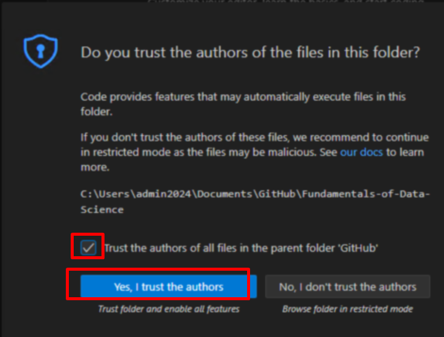

# **Khipus.ai**

# How to Clone a GitHub Repository Using GitHub Desktop

# © Copyright Notice 2025, Khipus.ai - All Rights Reserved.

This guide explains how to install GitHub Desktop and clone a repository step-by-step.

## Step 1: Install GitHub Desktop
1. **Download GitHub Desktop**:
   - Visit [https://desktop.github.com/download/](https://desktop.github.com/download/).
   - Click the **Download for [your OS]** button.

   

2. **Install GitHub Desktop**:
   - Open the downloaded installer file.
   

   - Follow the installation prompts for your operating system.

3. **Launch GitHub Desktop**:
   - Open GitHub Desktop after installation.
4. **Sign In**:
   - Sign in to your GitHub account. If you don’t have one, create an account at [GitHub.com](https://github.com/).

   

   

   

   

## Step 2: Clone a GitHub Repository
1. **Open GitHub Desktop**:
   - Ensure you are signed in.
2. **Initiate Cloning**:
   - Go to **File > Clone Repository**.
   
   
3. **Choose Repository**:
   - In the "Clone a Repository" dialog:
     - Use the **URL** tab to enter the repository URL (e.g., `https://github.com/Khipus-ai/Fundamentals-of-Data-Science`).
    
4. **Set Local Path**:
   - Select a local folder where the repository will be saved.
5. **Clone**:
   - Click **Clone** to download the repository.

## Step 3: Open in Visual Stdudio Code

## Step 4: Open and Run a Jupyter notebook (Python basics.ipynb)

---

For more details, visit the [GitHub Desktop Documentation](https://docs.github.com/en/desktop).
