# **Khipus.ai**
#  **Data Science Tools**

# How to export of a Jupyter notebook to PDF in Visual Studio Code

# © Copyright Notice 2025, Khipus.ai - All Rights Reserved.

This guide explains how to export of a Jupyter notebook to PDF in Visual Studio Code step-by-step.

## Export Jupyter Notebook to PDF

1. Download and install Pandoc from: https://github.com/jgm/pandoc/releases/tag/3.6.1

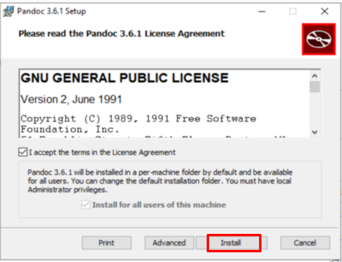

2. Download and install MikTeX: https://miktex.org/download

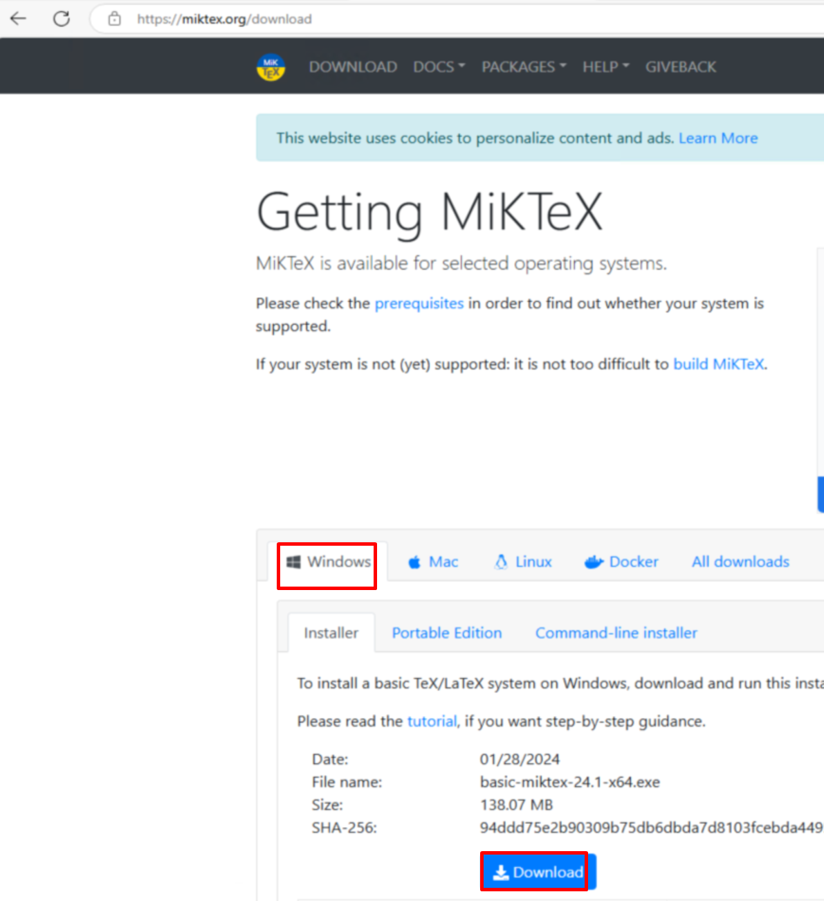
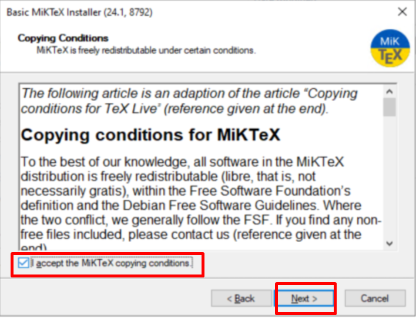
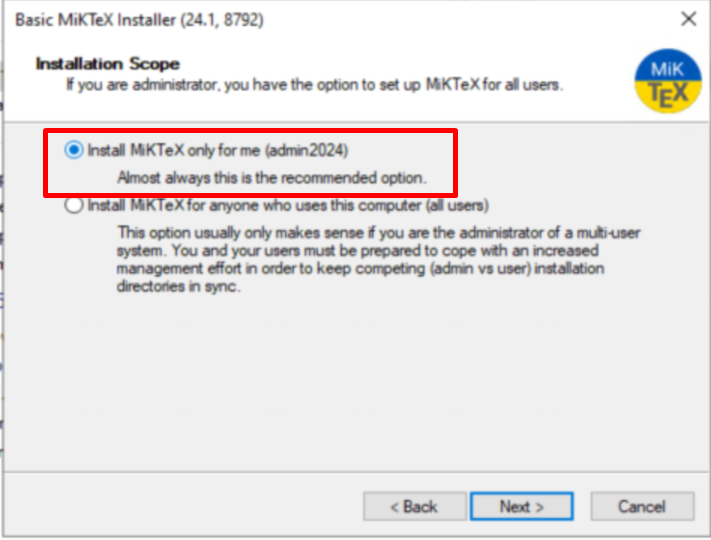


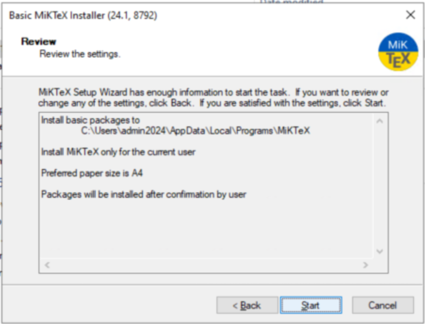


3. Verify Installations
Run the following commands in a terminal to verify that both tools are installed correctly:
   ```bash
   pandoc --version
   ```

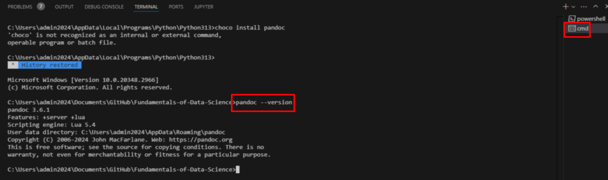

   ```bash
   xelatex --version
   ```
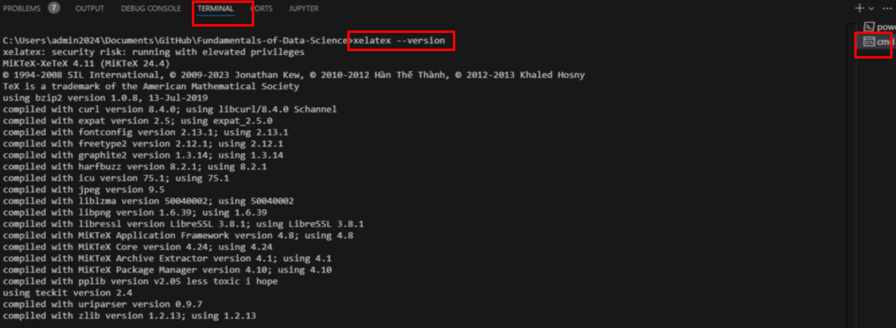

4. Open your Jupyter notebook in Visual Studio Code. If you already have Visual Studio Code open, close it and then reopen it. 

5. Run all cells to ensure the notebook is up-to-date.

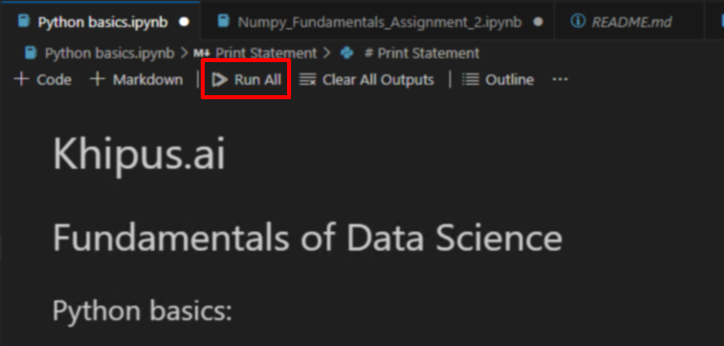


6. Access the Options Menu: The user clicks on the ... (three dots) menu located at the top-right corner of the notebook interface.

Select "Export": From the dropdown menu that appears, the user clicks on the Export option.

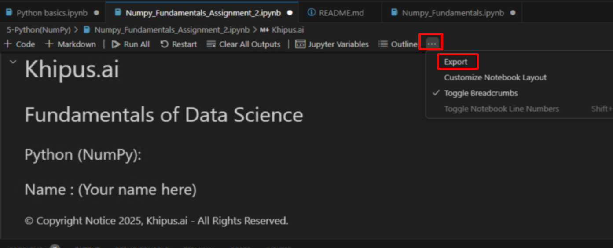


5. Save the notebook 


6. Install the missing packages.

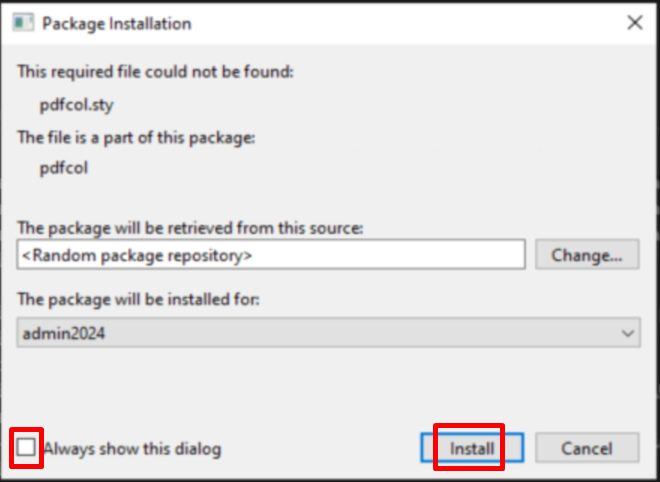

7. You should see a message in the left corner that says your file is being exported as a PDF file:


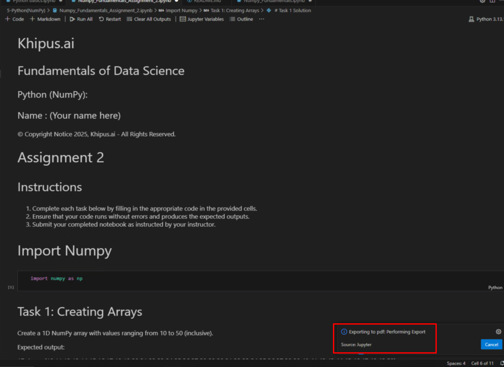


Note: The first time, the process will take about 5 minutes or more, depending on your internet speed

8. You have your pdf file ready:


## Upload the PDF file to the Khipus.ai Virtual Campus: 

1. Logs into the Khipus.ai platform using your credentials https://campus.khipus.ai/login/index.php

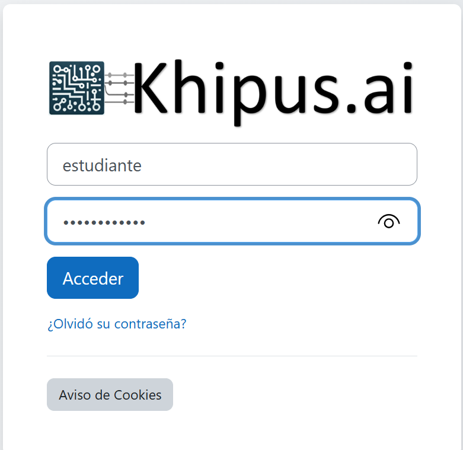

2. Navigate to the "Actividades" (Activities) section under "Unidad 1: Introducción a la Ciencia de Datos." and select the "Trabajo práctico Unidad 1" 
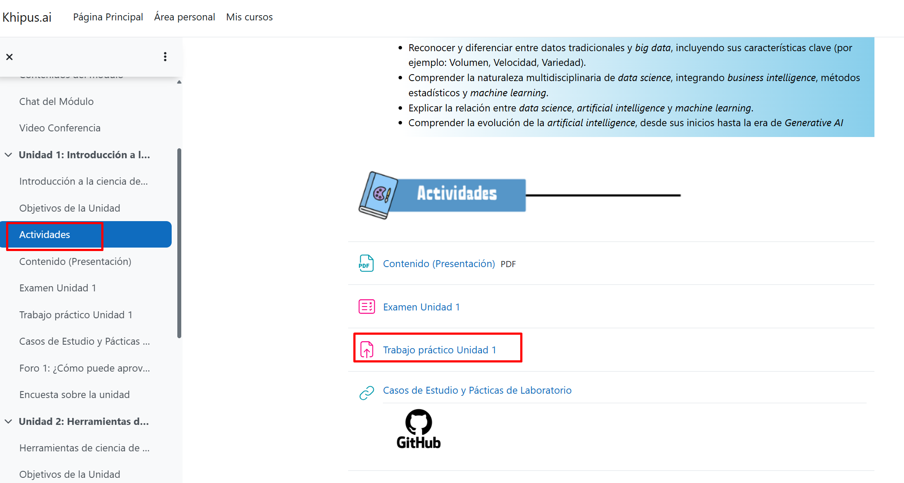

3. Click "Agregar entrega" (Add Submission) button to start the process of submitting the assignment.


4. "Choose File" and selects the PDF file

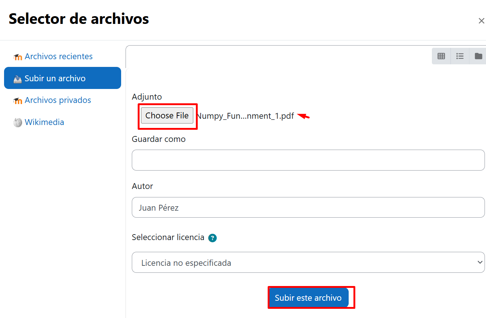

5. Finally, confirm the submission by clicking the "Guardar cambios"


