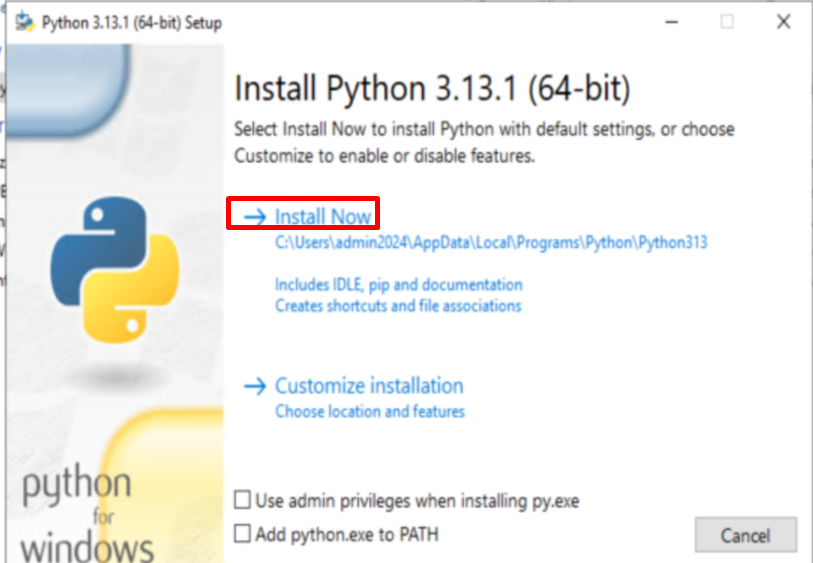
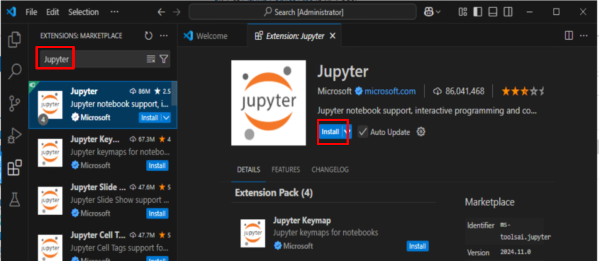
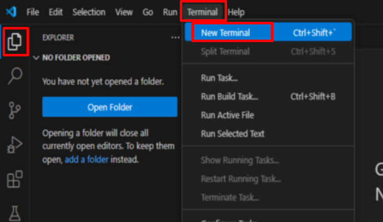
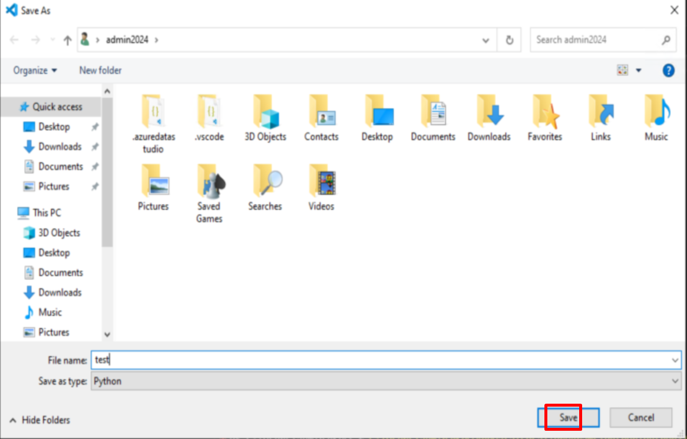
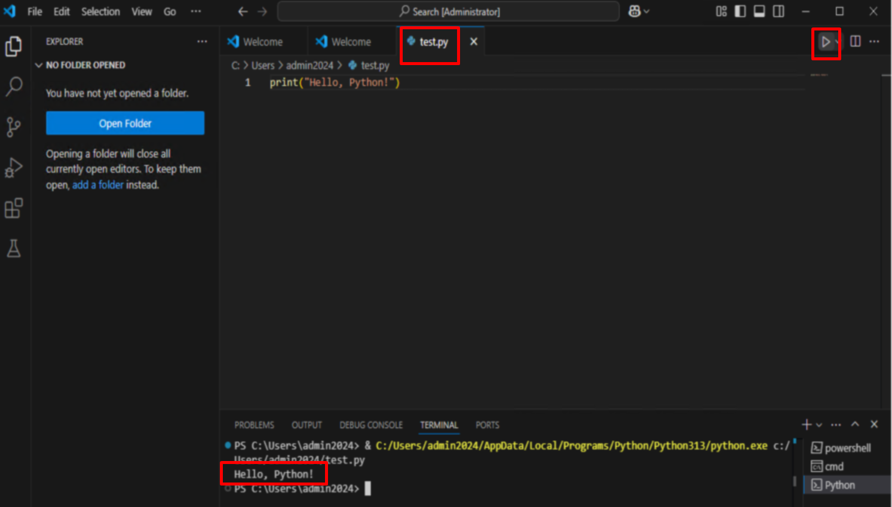

# **Khipus.ai**
# 📦 **Visual Studio Code Installation Guide**

# Python Development Environment Setup on Visual Studio Code

This guide will help you set up a Python development environment using Visual Studio Code (VS Code),to ensure you have everything you need for your coding projects and tutorials! 💻💡

## 📥 **Prerequisites**

- **Install Python**: Download and install Python from the [official Python website](https://www.python.org/downloads/). Make sure to check the box to add Python to your PATH during installation.

| 🖥️ **Operating System**   
|---------------------------|
| Windows, macOS, or Linux   | 





## Step-by-Step Installation


### 1: **Download Visual Studio Code**

1. **Download the Installer**:  
   Click the link below to download the **Visual Studio Code** installer:  
   - 📥 [**Download Visual Studio Code**](https://code.visualstudio.com/)

 

### 🔧 Step 2: **Install Visual Studio Code**

1. **Run the Installer**:  
   Double-click the downloaded file to start the installation process. 🖱️ 
    

2. **Follow the Installation Instructions**:  
   ✔️ Follow the prompts in the installer to complete the installation.
   

   

3. **Launch Visual Studio Code**:  
   🎉 Once installation is complete, launch **Visual Studio Code** from the Start Menu or desktop.
   

### 2. Install Python Extension for VS Code

1. Open VS Code.
2. Go to the Extensions view by clicking on the Extensions icon in the Activity Bar on the side of the window or pressing 
3. Search for "Python" and install the extension published by Microsoft.


### 3. Install Recommended Extensions

- **Jupyter**: For running Jupyter Notebooks directly in VS Code.


### 4. Install Virtual Environment Support

1. Open the integrated terminal in VS Code (`Ctrl+`` for Windows/Linux or `Cmd+`` for Mac).


2. Create a virtual environment:


   ```
   cd C:\Users\<YourUsername>\AppData\Local\Programs\Python\Python<version>\

   Example:cd C:\Users\admin2024\AppData\Local\Programs\Python\Python313\
   ```
   ```
   python -m venv venv
   ```
   

3. Activate the virtual environment:
   - **Windows**: `venv\Scripts\activate`
   - **Mac/Linux**: `source venv/bin/activate`
4. Install necessary Python packages:
   ```bash
   pip install --upgrade pip
   ```


### 5. Test Your Setup

1. Create a new Python file:


   ```
   print("Hello, Python!")
   ```
   

   

2. Run the file by pressing `F5` or right-clicking and selecting **Run Python File in Terminal**.


