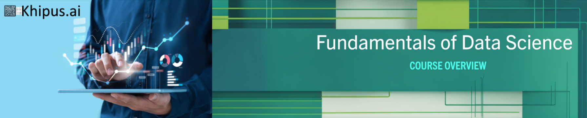

# **Khipus.ai**

# © Copyright Notice 2025, Khipus.ai - All Rights Reserved.

#  **Fundamentals-of-Data-Science **

## Welcome to the Fundamentals of Data Science module!

This introductory module is designed to introduce you to the basic concepts of data science, an interdisciplinary field that combines statistical analysis, machine learning, and domain expertise to extract insights from data. You will begin by exploring fundamental definitions of data, including traditional structured data and the more complex landscape of big data, characterized by its volume, velocity, and variety. Throughout the module, you will understand how data can be used for decision-making and predictions in various contexts, from business intelligence to advanced machine learning applications.

This module will also guide you through essential tools and technologies for effective data analysis. You will explore programming languages such as Python, along with key libraries like NumPy, Pandas, and Matplotlib for data manipulation and visualization. Additionally, you will become familiar with development environments such as Jupyter Notebooks and Visual Studio Code, as well as version control using Git and GitHub. By the end of this module, you will have a solid foundation, preparing you for more advanced topics such as applied statistics, machine learning, and artificial intelligence.